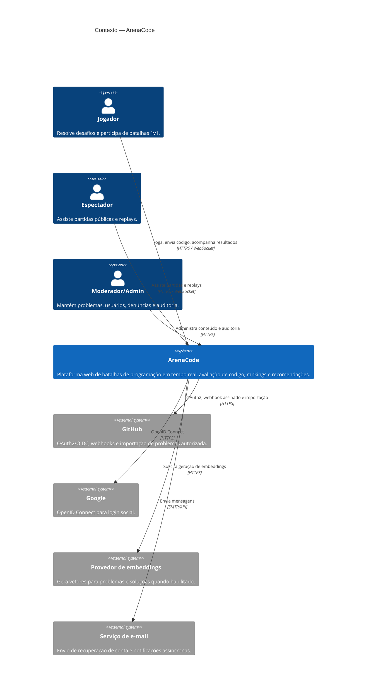
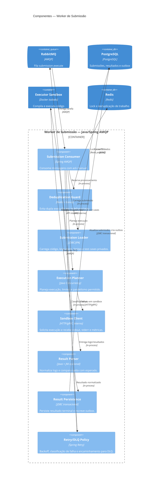
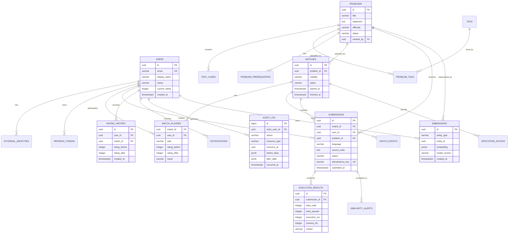
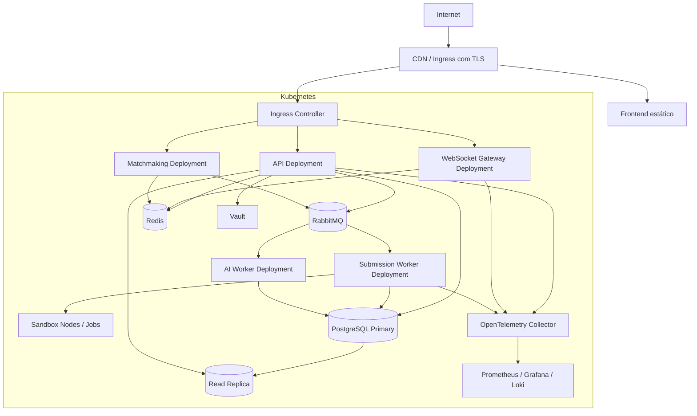

# ArenaCode — Canvas de Arquitetura C4

> Plataforma interativa de batalhas de programação em tempo real. Usuários jogam partidas 1v1, espectadores acompanham salas públicas, submissões são executadas com isolamento, e o sistema gera ranking, replays e recomendações de desafios.

## Objetivos de arquitetura

- Oferecer uma experiência interativa hospedada, com acesso rápido a partidas e modo espectador.
- Usar Java como linguagem principal de serviços de negócio e processamento assíncrono.
- Executar código não confiável em sandbox isolado, sem acesso à rede e com limites estritos de recursos.
- Escalar independentemente API, gateway WebSocket e workers de execução.
- Preservar rastreabilidade para resultados, rating, permissões e ações administrativas.
- Manter o projeto viável por incrementos: monólito modular no MVP e extração gradual de serviços.

## Decisões arquiteturais

| Decisão | Escolha | Justificativa |
|---|---|---|
| Estilo inicial | Monólito modular Spring Boot | Reduz complexidade operacional sem impedir divisão futura por fronteiras de domínio. |
| Backend principal | Java 21 + Spring Boot 3 | Demonstra domínio de Java moderno, Spring Security, JPA, mensageria e observabilidade. |
| API síncrona | REST `/api/v1` + OpenAPI | Integrações simples, contratos documentados e versionamento explícito. |
| Tempo real | WebSocket/STOMP ou WebFlux WebSocket | Propaga estado de salas, timer, placar e presença sem polling. |
| Persistência transacional | PostgreSQL | Relacionamentos complexos, transações ACID, procedures, triggers e window functions. |
| Busca vetorial | pgvector inicialmente | Mantém dados relacionais e embeddings no mesmo banco no MVP; Qdrant pode ser extraído em escala. |
| Cache e rate limiting | Redis | Rate limiting, presença temporária, cache de ranking e coordenação leve. |
| Mensageria | RabbitMQ | Filas, confirmação, retry e DLQ são adequados a submissões e notificações. |
| Execução de código | Worker Java + Docker sandbox | Isola código submetido e separa API da carga de CPU. |
| Identidade | OAuth2/OIDC + JWT | Login social, tokens curtos para API e token no handshake WebSocket. |
| Segredos | Vault em produção; Secrets no Kubernetes no ambiente de demonstração | Remove credenciais do repositório e permite rotação. |
| Escala de WebSocket | Consistent hashing por `matchId` | Mantém afinidade de sala ao distribuir conexões entre gateways. |
| Otimização de baixo nível | Biblioteca C via JNI | Demonstra memory pool e redução de alocações no parser de logs de sandbox. |

---

# Nível 1 — Contexto do Sistema



## Jornadas principais

1. Um visitante entra como convidado ou autentica-se com e-mail, GitHub ou Google.
2. O jogador entra na fila de matchmaking ou abre uma sala privada por link.
3. Dois jogadores recebem o mesmo desafio; o estado da partida é distribuído em tempo real.
4. Uma submissão é aceita pela API, registrada como pendente e publicada na fila.
5. Um worker executa o código em sandbox, persiste o resultado e publica eventos de atualização.
6. O gateway WebSocket atualiza jogadores e espectadores; o término recalcula rating em transação.
7. Após a partida, o sistema gera replay, atualiza ranking e agenda análise de similaridade/recomendação.

---

# Nível 2 — Contêineres

```mermaid
C4Container
    title Contêineres — ArenaCode

    Person(player, "Jogador/Espectador", "Usa navegador web.")
    Person(admin, "Moderador/Admin", "Usa painel administrativo.")

    System_Boundary(arena, "ArenaCode") {
        Container(web, "Aplicação Web", "React + TypeScript + Monaco Editor", "Interface para partidas, editor, ranking, perfil e replays.")
        Container(api, "API de Domínio", "Java 21, Spring Boot", "REST versionado, autenticação, autorização, regras de negócio e orquestração transacional.")
        Container(ws, "Gateway de Tempo Real", "Java 21, Spring Boot WebSocket", "Handshake JWT, presença, tópicos de salas e entrega de eventos ao vivo.")
        Container(matchmaker, "Serviço de Matchmaking", "Java 21, Spring Boot", "Forma pares por rating, disponibilidade e regras ABAC.")
        Container(worker, "Workers de Submissão", "Java 21, Spring AMQP", "Consomem tarefas, chamam sandbox, gravam resultados e enviam eventos.")
        Container(sandbox, "Executor Sandbox", "Docker isolado", "Compila e executa código com cgroups, timeout, filesystem temporário e rede bloqueada.")
        Container(aiworker, "Worker de IA", "Java 21 ou Python isolado", "Gera embeddings, recomendações e alertas de similaridade.")
        ContainerDb(postgres, "Banco Transacional", "PostgreSQL + pgvector", "Dados relacionais, auditoria, ranking, procedures, triggers e vetores.")
        ContainerDb(replica, "Réplica de Leitura", "PostgreSQL", "Consultas de ranking, replays e relatórios de leitura.")
        ContainerDb(redis, "Cache e Coordenação", "Redis", "Rate limit, presença, cache, locks distribuídos e estado temporário.")
        ContainerQueue(rabbit, "Broker de Mensagens", "RabbitMQ", "Filas de submissão, eventos de partida, notificações, retry e DLQ.")
        Container(vault, "Gerenciador de Segredos", "Vault", "Emite e armazena credenciais e chaves fora do código.")
        Container(obs, "Observabilidade", "Prometheus, Grafana, Loki/ELK, OpenTelemetry", "Métricas, logs estruturados, traces, dashboards e alertas.")
    }

    System_Ext(github, "GitHub", "OAuth/OIDC e webhooks")
    System_Ext(google, "Google", "OIDC")
    System_Ext(embedding, "Provedor de Embeddings", "API de embeddings")

    Rel(player, web, "Usa", "HTTPS")
    Rel(admin, web, "Administra", "HTTPS")
    Rel(web, api, "Consome API", "HTTPS/JSON")
    Rel(web, ws, "Recebe eventos e envia presença", "WSS")
    Rel(api, postgres, "Lê e grava dados de negócio", "JDBC/JPA")
    Rel(api, replica, "Consulta dados de leitura", "JDBC/JPA")
    Rel(api, redis, "Rate limit, cache e locks", "Redis protocol")
    Rel(api, rabbit, "Publica tarefas e eventos", "AMQP")
    Rel(api, vault, "Obtém segredos", "HTTPS")
    Rel(api, github, "OAuth e webhook", "HTTPS")
    Rel(api, google, "OIDC", "HTTPS")
    Rel(matchmaker, redis, "Coordena fila de jogadores", "Redis protocol")
    Rel(matchmaker, postgres, "Cria partidas", "JDBC/JPA")
    Rel(matchmaker, rabbit, "Publica eventos de partida", "AMQP")
    Rel(worker, rabbit, "Consome submissões", "AMQP")
    Rel(worker, sandbox, "Solicita compilação e execução", "API interna")
    Rel(worker, postgres, "Persiste resultado", "JDBC/JPA")
    Rel(worker, rabbit, "Publica resultados", "AMQP")
    Rel(aiworker, rabbit, "Consome eventos finais", "AMQP")
    Rel(aiworker, postgres, "Lê/grava embeddings e recomendações", "JDBC")
    Rel(aiworker, embedding, "Gera embeddings", "HTTPS")
    Rel(ws, rabbit, "Consome eventos para broadcast", "AMQP")
    Rel(ws, redis, "Presença e roteamento por sala", "Redis protocol")
    Rel(postgres, replica, "Replicação primária-réplica", "Streaming replication")
    Rel(api, obs, "Logs, métricas e traces", "OTLP/HTTP")
    Rel(ws, obs, "Logs, métricas e traces", "OTLP/HTTP")
    Rel(worker, obs, "Logs, métricas e traces", "OTLP/HTTP")
```



## Fronteiras de responsabilidade

| Contêiner | Responsabilidade primária | Não deve fazer |
|---|---|---|
| Aplicação Web | Experiência do usuário e edição de código | Decidir vencedor, calcular rating ou executar código. |
| API de Domínio | Regras síncronas, autorização e transações | Executar código submetido em processo próprio. |
| Gateway WebSocket | Entrega de eventos e presença | Ser fonte de verdade da partida. |
| Matchmaking | Pareamento e criação atômica de salas | Avaliar submissões ou alterar resultado de testes. |
| Worker de Submissão | Orquestrar avaliação assíncrona | Expor endpoints públicos. |
| Sandbox | Compilar/executar com isolamento | Acessar banco, broker ou internet pública. |
| Worker de IA | Embeddings, recomendação e similaridade | Bloquear fluxo crítico de partida. |

---

# Nível 3 — Componentes da API de Domínio

```mermaid
C4Component
    title Componentes — API de Domínio

    Container(web, "Aplicação Web", "React", "Cliente web")
    Container(ws, "Gateway de Tempo Real", "Spring WebSocket", "Eventos de sala")
    ContainerQueue(rabbit, "RabbitMQ", "AMQP", "Mensageria")
    ContainerDb(postgres, "PostgreSQL", "PostgreSQL + pgvector", "Persistência")
    ContainerDb(redis, "Redis", "Redis", "Cache/limites/locks")
    System_Ext(identity, "Google/GitHub", "OAuth2/OIDC")

    Container_Boundary(api, "API de Domínio — Spring Boot") {
        Component(auth, "AuthController e Token Service", "Spring Security OAuth2 Resource Server", "Login, refresh token, logout e validação JWT.")
        Component(problem, "Problem Controller/Service", "Spring MVC + JPA", "CRUD, busca e publicação de desafios/test cases.")
        Component(match, "Match Controller/Service", "Spring MVC + JPA", "Salas, convite, início/fim e autorização de acesso.")
        Component(submission, "Submission Controller/Service", "Spring MVC + JPA", "Aceita submissão, impõe idempotência e publica tarefa.")
        Component(rating, "Rating Service", "Spring Transactional + JDBC", "Atualiza Elo/Glicko, histórico e ranking em transação.")
        Component(leaderboard, "Leaderboard Query Service", "JDBC/JPA", "Consultas otimizadas, cache e read replica.")
        Component(replay, "Replay Service", "JPA", "Timeline de eventos e visualização de partidas concluídas.")
        Component(recommendation, "Recommendation Query Service", "JDBC + pgvector", "Recupera problemas similares e recomendações prontas.")
        Component(audit, "Audit Service", "JPA + PostgreSQL", "Consulta auditoria e registra contexto de requisições.")
        Component(policy, "Authorization Policy Service", "Spring Security", "RBAC e ABAC por dono, visibilidade, rating e estado da partida.")
        Component(outbox, "Outbox Publisher", "Spring Scheduler/AMQP", "Publica eventos persistidos sem perder consistência entre banco e broker.")
        Component(error, "Global Error Handler", "Problem Details RFC 9457", "Erros padronizados, correlação e respostas seguras.")
    }

    Rel(web, auth, "Autentica e renova token", "HTTPS")
    Rel(web, problem, "Consulta desafios", "HTTPS")
    Rel(web, match, "Cria/entra em salas", "HTTPS")
    Rel(web, submission, "Envia código", "HTTPS")
    Rel(web, leaderboard, "Consulta ranking", "HTTPS")
    Rel(web, replay, "Consulta replay", "HTTPS")
    Rel(auth, identity, "Fluxo OAuth2/OIDC", "HTTPS")
    Rel(problem, policy, "Autoriza alteração", "in-process")
    Rel(match, policy, "Autoriza acesso à sala", "in-process")
    Rel(submission, policy, "Autoriza submissão", "in-process")
    Rel(submission, redis, "Rate limit e chave de idempotência", "Redis protocol")
    Rel(submission, postgres, "Cria submissão PENDING e outbox", "JDBC/JPA")
    Rel(match, postgres, "Persiste partida e participantes", "JDBC/JPA")
    Rel(rating, postgres, "Atualiza rating com lock/transação", "JDBC")
    Rel(leaderboard, redis, "Lê/escreve cache", "Redis protocol")
    Rel(leaderboard, postgres, "Consulta ranking e histórico", "JDBC")
    Rel(recommendation, postgres, "Busca vetorial e filtros", "JDBC")
    Rel(audit, postgres, "Consulta eventos de auditoria", "JDBC/JPA")
    Rel(outbox, postgres, "Lê eventos pendentes", "JDBC")
    Rel(outbox, rabbit, "Publica eventos", "AMQP")
    Rel(rabbit, ws, "Eventos para jogadores/espectadores", "AMQP")
```



## Módulos e agregados

| Módulo | Agregados/entidades | Invariantes principais |
|---|---|---|
| Identity | `User`, `Role`, `RefreshToken`, `ExternalIdentity` | E-mail único; token revogado não pode ser reutilizado; papéis são auditados. |
| Problem | `Problem`, `TestCase`, `Tag`, `ProblemPrerequisite` | Test case privado nunca é exposto ao cliente; somente moderador publica problemas. |
| Match | `Match`, `MatchPlayer`, `SpectatorAccess`, `MatchEvent` | Uma pessoa não joga duas partidas ativas; partida só inicia com dois jogadores válidos. |
| Submission | `Submission`, `ExecutionResult`, `IdempotencyKey` | Uma chave idempotente retorna sempre a mesma submissão; resultado terminal não pode voltar a pendente. |
| Rating | `RatingHistory`, `LeaderboardSnapshot` | Rating dos dois jogadores é atualizado na mesma transação ao encerrar uma partida. |
| Recommendation | `Embedding`, `Recommendation`, `SimilarityAlert` | Recomendações são derivadas e podem falhar sem impedir partidas. |
| Audit | `AuditLog`, `SecurityEvent`, `OutboxEvent` | Alterações sensíveis deixam trilha imutável; evento de outbox só é marcado como publicado após confirmação. |

---

# Nível 4 — Componentes do Worker de Submissão



## Segurança do sandbox

- O código do usuário nunca roda dentro do processo da API, do worker ou do gateway WebSocket.
- Cada execução usa container descartável com usuário sem privilégios, filesystem somente leitura quando possível, diretório temporário limitado, rede desabilitada, PID limit, limites de CPU/memória e timeout.
- O executor aceita somente imagens pré-aprovadas por linguagem; não aceita comandos de shell arbitrários enviados pelo navegador.
- Saídas `stdout` e `stderr` sofrem truncamento; resultados e logs são tratados como dados não confiáveis e escapados na interface.
- O ambiente de demonstração deve limitar linguagens inicialmente a Java e Python, reduzindo a superfície de ataque e a complexidade de imagens.

---

# Modelo de Dados Essencial



## Relacionamentos e consultas exigidas

| Recurso SQL | Uso concreto no ArenaCode |
|---|---|
| `INNER JOIN` | Partidas, jogadores e problema correspondente em histórico de usuário. |
| `LEFT JOIN` | Lista de problemas com estatísticas, incluindo desafios ainda sem submissões. |
| `RIGHT JOIN` | Relatório administrativo de todas as tags e quantidade de problemas associados, preservando tags sem problemas. |
| `FULL OUTER JOIN` | Reconciliação entre eventos publicados na outbox e eventos confirmados/consumidos. |
| Self-join | `problem_prerequisites(problem_id, prerequisite_problem_id)` para mapear dependências de aprendizagem. |
| `ROW_NUMBER()` | Ranking por linguagem e intervalo de tempo, evitando empates de paginação. |
| `LAG()` | Evolução de rating e variação entre partidas consecutivas. |
| `LEAD()` | Próximo evento do replay e cálculo de intervalo entre submissões. |
| Índices compostos | `submissions(problem_id, language, status, submitted_at DESC)` e `match_players(user_id, match_id)`. |
| `EXPLAIN (ANALYZE, BUFFERS)` | Evidência documentada de otimização de ranking, histórico e busca de replay. |

---

# Fluxo Crítico — Submissão de Código

```mermaid
sequenceDiagram
    autonumber
    participant U as Jogador
    participant W as Aplicação Web
    participant A as API de Domínio
    participant R as Redis
    participant P as PostgreSQL
    participant Q as RabbitMQ
    participant K as Worker
    participant S as Sandbox
    participant G as Gateway WebSocket

    U->>W: Envia código
    W->>A: POST /api/v1/submissions (JWT + Idempotency-Key)
    A->>R: Verifica rate limit e idempotência
    alt Chave já processada
        R-->>A: submissionId existente
        A-->>W: 200 com resultado/estado existente
    else Nova submissão
        A->>P: BEGIN; cria SUBMISSION(PENDING) e OUTBOX_EVENT
        A->>P: COMMIT
        A->>Q: Publica submission.execute
        A-->>W: 202 Accepted + submissionId
        Q->>K: Entrega tarefa
        K->>R: Adquire lock de processamento
        K->>P: Carrega código e test cases
        K->>S: Compila e executa com limites
        S-->>K: Resultado, logs truncados e métricas
        K->>P: BEGIN; atualiza resultado e grava OUTBOX_EVENT
        K->>P: COMMIT
        K->>Q: Publica submission.evaluated
        Q->>G: Evento de resultado
        G-->>W: Atualização ao vivo por WebSocket
    end
```

## Transações e consistência

- A criação de submissão persiste `submission` e `outbox_event` na mesma transação; assim, uma submissão aceita não depende de publicar no broker antes do commit.
- O consumidor pode receber a mesma mensagem mais de uma vez; por isso usa chave de idempotência, lock com TTL e estado terminal imutável.
- O encerramento de uma partida bloqueia as linhas dos dois participantes, recalcula ambos os ratings e grava o histórico em uma única transação com `COMMIT` ou `ROLLBACK` explícito.
- A entrega de eventos é **at-least-once**; consumidores devem ser idempotentes.

---

# Segurança e Autorização

## Papéis RBAC

| Papel | Permissões principais |
|---|---|
| `GUEST` | Navegar, criar sessão temporária e assistir salas públicas permitidas. |
| `USER` | Jogar, criar salas, enviar submissões, ver seu histórico e gerenciar perfil. |
| `MODERATOR` | Criar/publicar problemas, revisar alertas de similaridade e moderar conteúdo. |
| `ADMIN` | Gerir usuários, papéis, bans, configurações e consultar auditoria completa. |
| `WORKER` | Identidade de serviço limitada a consumo de fila e atualização de execução. |

## Regras ABAC

| Recurso | Regra por atributo |
|---|---|
| Partida privada | Permitida se `user.id` estiver em `match_players` ou `spectator_access`. |
| Código durante a partida | Permitido apenas ao próprio autor; oponente/espectador recebe progresso agregado. |
| Sala pública | Espectador só entra quando `match.visibility = PUBLIC` e status permite observação. |
| Matchmaking | Usuário elegível se estiver ativo, não banido, sem partida ativa e dentro da faixa de rating configurada. |
| Problema não publicado | Visível apenas a `MODERATOR` ou `ADMIN`. |
| Auditoria | Dados completos somente para `ADMIN`; moderador vê somente casos vinculados à moderação. |

## Controles essenciais

- Access token JWT curto, refresh token rotacionado e armazenado de modo seguro; revogação registrada no banco.
- O token JWT do WebSocket é validado no handshake e a autorização é reavaliada por destino/tópico.
- OAuth2/OIDC usa `state`, PKCE e validação de emissor, público, assinatura e expiração do token de identidade.
- Rate limit por IP, usuário e rota; limites mais rigorosos para login, criação de sala e submissões.
- Validação de payloads com Bean Validation; saída de código/log sempre escapada no frontend para reduzir risco de XSS.
- Consultas parametrizadas/JPA; proibição de SQL construído com concatenação de dados do usuário.
- Headers de segurança: HSTS, CSP, `X-Content-Type-Options`, `Referrer-Policy` e proteção apropriada contra clickjacking.
- Secrets carregados por Vault/Kubernetes Secrets, nunca commitados em `.properties`, `.env` versionado ou imagens Docker.

---

# Implantação e Operação



## Kubernetes

| Recurso | Aplicação |
|---|---|
| `Deployment` | API, gateway WebSocket, matchmaking, worker de submissão, worker de IA. |
| `Service` | Descoberta interna de API, WebSocket, RabbitMQ, Redis e executor sandbox. |
| `Ingress` | TLS, roteamento HTTP e upgrade WebSocket. |
| `ConfigMap` | Limites de partida, feature flags e configurações não sensíveis. |
| `Secret` | Credenciais de infraestrutura em demo; em produção, referências/credenciais do Vault. |
| `HPA` | API por CPU/latência; workers por CPU e tamanho da fila; gateway por conexões ativas. |
| `NetworkPolicy` | Sandbox sem egress; workers com acesso apenas a broker, banco e executor permitido. |
| `PodDisruptionBudget` | Mínimo de réplicas para API/gateway durante manutenção. |

## Autoscaling e hashing

- Workers escalam conforme `queue_depth` e `consumer_lag`; a fila absorve picos sem saturar a API.
- O gateway WebSocket escala por conexões ativas e uso de CPU/memória.
- Um anel de consistent hashing usa `matchId` como chave para determinar o shard lógico da sala; Redis mantém metadados de roteamento e presença com TTL.
- Se um gateway falhar, as conexões reconectam; o cliente recupera o estado da sala pela API e reassina o tópico correspondente.

## Replicação de banco

- PostgreSQL primário aceita escritas de usuários, partidas, submissões e auditoria.
- Uma réplica atende ranking, replays, relatórios e consultas de leitura que toleram pequena defasagem.
- Fluxos que dependem de leitura imediatamente consistente continuam no primário; essa regra deve estar explícita no repositório de dados.

---

# Observabilidade e Resiliência

## Métricas mínimas

| Área | Métricas |
|---|---|
| HTTP | Taxa de requisições, p50/p95/p99 de latência, erros por rota/status, conexões ativas. |
| WebSocket | Conexões por instância, reconexões, mensagens enviadas/falhas, latência de broadcast. |
| RabbitMQ | Profundidade por fila, idade da mensagem mais antiga, taxa de consumo, retries e DLQ. |
| Sandbox | Tempo de compilação/execução, timeout, memória, erros por linguagem e taxa de rejeição. |
| PostgreSQL | Latência de query, conexões, locks, deadlocks, cache hit, lag da réplica e slow queries. |
| Negócio | Partidas iniciadas/finalizadas, submissões aceitas, taxa de aprovação, matchmaking wait time. |

## Logs, traces e alertas

- Logs JSON incluem `traceId`, `spanId`, `requestId`, `userId` pseudonimizado, `matchId`, `submissionId`, rota, status e duração.
- OpenTelemetry propaga contexto HTTP → outbox → RabbitMQ → worker → sandbox.
- Alertas: DLQ com mensagens, fila crescendo continuamente, taxa de erro elevada, indisponibilidade de banco/broker, aumento de timeout de sandbox e lag de réplica excessivo.
- Health checks: `liveness` verifica processo; `readiness` confirma dependências necessárias para receber tráfego; sandbox é checado separadamente.

## Falhas previstas

| Falha | Estratégia |
|---|---|
| Provedor OAuth indisponível | Login local permanece disponível; erros não expõem detalhes do provedor. |
| RabbitMQ indisponível | API persiste outbox; publisher tenta novamente com backoff/circuit breaker. |
| Worker falha durante execução | Mensagem não confirmada é redeliverada; deduplicação evita resultado duplicado. |
| Sandbox excede recursos | Container é encerrado; submissão recebe `TIME_LIMIT_EXCEEDED` ou `MEMORY_LIMIT_EXCEEDED`. |
| pgvector/IA indisponível | Partidas e submissões continuam; recomendações exibem fallback sem similaridade. |
| Gateway WebSocket cai | Cliente reconecta, consulta snapshot da partida e retoma eventos. |
| Read replica atrasada | Endpoints que exigem consistência leem do primário; UI informa atualização eventual quando aplicável. |

---

# Pipeline CI/CD

```mermaid
flowchart LR
    DEV[Push / Pull Request] --> LINT[Checkstyle, Spotless, Sonar/SpotBugs]
    LINT --> UNIT[Testes unitários: JUnit 5]
    UNIT --> INT[Testes de integração: Testcontainers]
    INT --> SEC[SAST, scan de dependências e imagens]
    SEC --> BUILD[Build multi-stage Docker]
    BUILD --> CONTRACT[Testes de contrato/OpenAPI]
    CONTRACT --> E2E[Testes end-to-end]
    E2E --> REG[Registry de imagens]
    REG --> STG[Deploy em staging]
    STG --> SMOKE[Smoke test + migrations]
    SMOKE --> PROD[Deploy produção via Helm/Kustomize]
```



## Qualidade de código

- Java: JUnit 5, Mockito, AssertJ, ArchUnit, Testcontainers, Checkstyle/Spotless, SpotBugs e análise estática.
- Frontend: testes de componentes, testes de integração e E2E com Playwright/Cypress.
- Banco: migrations versionadas com Flyway; migrations são testadas em banco efêmero antes de deploy.
- Imagens: builds multi-stage, execução com usuário não-root, SBOM e varredura de vulnerabilidades.
- Política de entrega: pull request exige lint, testes, análise de segurança e revisão; deploy só promove artefato imutável.

---

# Roadmap Arquitetural

## Fase 1 — Demo interativa

- Aplicação web, Java/Spring Boot modular, PostgreSQL, Redis e Docker Compose.
- Login convidado e e-mail/senha; uma linguagem de execução (Java).
- Sala 1v1 por convite, timer, editor Monaco, WebSocket e resultado básico.
- Executor sandbox local controlado e poucos problemas próprios.
- README, OpenAPI, diagrama C4 e vídeo curto de demonstração.

## Fase 2 — Confiabilidade

- RabbitMQ, worker separado, outbox, DLQ, idempotência e reprocessamento seguro.
- Auditoria por triggers e procedures; transações explícitas para início/fim de partidas e rating.
- Matchmaking automático, ranking com window functions, replay e observabilidade inicial.

## Fase 3 — Segurança e escala

- OAuth2/OIDC, RBAC/ABAC, rate limiting, Vault e políticas de rede.
- Kubernetes, Ingress TLS, HPA, monitoramento completo, réplica de leitura e consistent hashing para salas.
- Testes de carga e documentação de resultados com métricas p95/p99.

## Fase 4 — IA e baixo nível

- Pipeline de embeddings de problemas, pgvector, recomendação híbrida e alertas de similaridade.
- Implementação opcional e medida de memory pool em C via JNI no parser de logs do worker.
- Benchmark reproduzível comparando throughput, alocações e latência antes/depois.

---

# Critérios de Aceite da Demonstração

- Um visitante consegue criar uma sessão convidada, abrir uma sala e compartilhar um link de convite.
- Dois navegadores diferentes conseguem entrar na mesma sala e enxergar timer e eventos sincronizados via WebSocket.
- Uma submissão Java válida retorna `202 Accepted`, é processada fora da API e atualiza o placar sem recarregar a página.
- Uma submissão maliciosa ou infinita não acessa rede, não afeta o host e é encerrada por limite de tempo/recursos.
- A mesma `Idempotency-Key` não cria duas submissões nem gera dois efeitos de rating.
- O encerramento de uma partida altera os ratings dos dois jogadores de forma atômica e deixa registros de auditoria.
- O ranking e o replay estão navegáveis; o replay mostra eventos ordenados e não expõe test cases privados.
- O repositório fornece execução local com Docker Compose, OpenAPI, diagramas C4, migrations e instruções de deploy.
