# ArenaCode — Diagrama de Classes Completo

> Modelo de domínio e classes técnicas do ArenaCode. O projeto é Java-first, organizado preferencialmente como monólito modular no início, com fronteiras que permitem extrair serviços sem reescrever o domínio.

## Convenções

- `<<Entity>>`: entidade JPA persistida no PostgreSQL.
- `<<ValueObject>>`: objeto imutável sem identidade própria.
- `<<Enum>>`: enumeração Java persistida como texto quando aplicável.
- `<<DTO>>`: contrato de entrada/saída da API.
- `<<Repository>>`: porta de persistência; a implementação pode usar Spring Data JPA ou JDBC.
- `<<Service>>`: serviço de aplicação/domínio.
- `<<Controller>>`: adaptador REST.
- `<<Event>>`: evento de domínio/integração publicado pela outbox/RabbitMQ.
- IDs usam `UUID`, e horários usam `Instant` ou `OffsetDateTime` em UTC.

---

# Visão Geral do Domínio

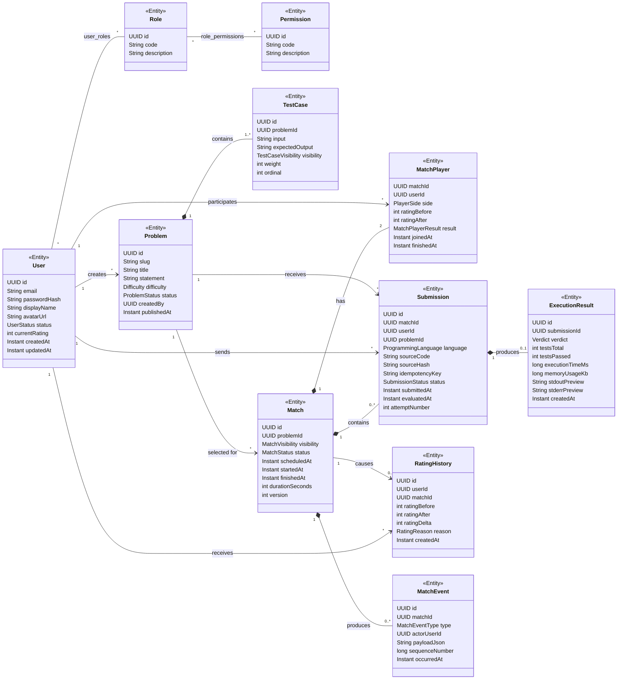

---

# Identidade e Segurança

```mermaid
classDiagram
    direction TB

    class User {
        <<Entity>>
        UUID id
        String email
        String passwordHash
        String displayName
        String avatarUrl
        UserStatus status
        int currentRating
        Instant createdAt
        Instant updatedAt
        activate() void
        suspend(reason) void
        ban(reason) void
        changeProfile(displayName, avatarUrl) void
        canPlay() boolean
    }

    class ExternalIdentity {
        <<Entity>>
        UUID id
        UUID userId
        IdentityProvider provider
        String providerSubject
        String providerEmail
        Instant linkedAt
    }

    class RefreshToken {
        <<Entity>>
        UUID id
        UUID userId
        String tokenHash
        Instant expiresAt
        Instant revokedAt
        String deviceFingerprint
        String ipAddressHash
        isActive(now) boolean
        revoke(at) void
    }

    class Role {
        <<Entity>>
        UUID id
        String code
        String description
    }

    class Permission {
        <<Entity>>
        UUID id
        String code
        String description
    }

    class UserRole {
        <<Entity>>
        UUID userId
        UUID roleId
        UUID grantedBy
        Instant grantedAt
    }

    class RolePermission {
        <<Entity>>
        UUID roleId
        UUID permissionId
    }

    class LoginAttempt {
        <<Entity>>
        UUID id
        String emailHash
        String ipAddressHash
        boolean succeeded
        String failureReason
        Instant occurredAt
    }

    class AuthorizationContext {
        <<ValueObject>>
        UUID authenticatedUserId
        Set~String~ roles
        Set~String~ permissions
        String requestIp
        UUID resourceOwnerId
        Map~String,Object~ attributes
        hasRole(role) boolean
        hasPermission(permission) boolean
    }

    class PolicyDecision {
        <<ValueObject>>
        boolean allowed
        String reason
        String policyCode
    }

    class AuthorizationPolicy {
        <<Interface>>
        supports(action, resourceType) boolean
        evaluate(context, resource) PolicyDecision
    }

    class MatchAccessPolicy {
        <<Service>>
        evaluate(context, match) PolicyDecision
    }

    class ProblemAccessPolicy {
        <<Service>>
        evaluate(context, problem) PolicyDecision
    }

    class AuditAccessPolicy {
        <<Service>>
        evaluate(context, auditLog) PolicyDecision
    }

    class JwtService {
        <<Service>>
        issueAccessToken(user) String
        issueWebSocketToken(user, matchId) String
        validate(token) JwtClaims
        revokeRefreshToken(token) void
    }

    class OAuthIdentityService {
        <<Service>>
        resolveOrCreateUser(providerData) User
        linkIdentity(userId, providerData) ExternalIdentity
    }

    class UserStatus {
        <<Enum>>
        GUEST
        ACTIVE
        SUSPENDED
        BANNED
        DELETED
    }

    class IdentityProvider {
        <<Enum>>
        LOCAL
        GOOGLE
        GITHUB
    }

    User "1" *-- "0..*" ExternalIdentity
    User "1" *-- "0..*" RefreshToken
    User "1" -- "0..*" UserRole
    Role "1" -- "0..*" UserRole
    Role "1" -- "0..*" RolePermission
    Permission "1" -- "0..*" RolePermission
    AuthorizationPolicy <|.. MatchAccessPolicy
    AuthorizationPolicy <|.. ProblemAccessPolicy
    AuthorizationPolicy <|.. AuditAccessPolicy
    JwtService ..> RefreshToken : validates/revokes
    OAuthIdentityService ..> ExternalIdentity : manages
    OAuthIdentityService ..> User : resolves
```

## Regras de segurança no modelo

- `UserStatus.BANNED` e `UserStatus.SUSPENDED` impedem entrada no matchmaking e criação de submissões.
- `RefreshToken` armazena somente hash do token; o valor puro só existe no cliente, preferencialmente em cookie `HttpOnly`, `Secure` e `SameSite` apropriado.
- `AuthorizationContext` consolida RBAC (papéis/permissões) e ABAC (proprietário, visibilidade, rating, estado da partida e demais atributos).
- `JwtService.issueWebSocketToken()` cria token de curta duração, com audiência e `matchId` opcionais, válido somente para o handshake WebSocket correspondente.

---

# Catálogo de Problemas

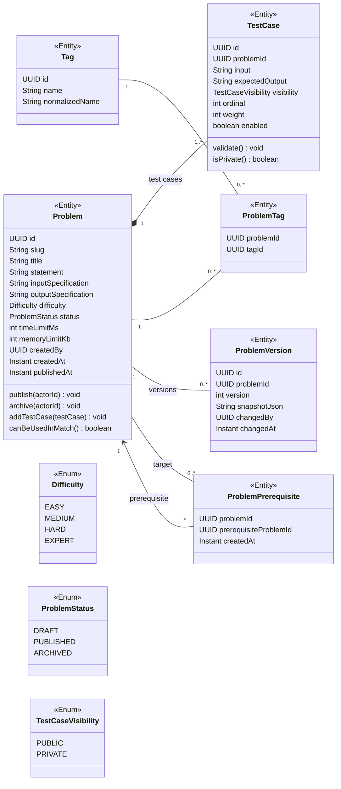

## Invariantes do catálogo

- Apenas problemas `PUBLISHED`, com pelo menos um caso privado habilitado e limites definidos, podem ser selecionados para uma partida.
- `ProblemPrerequisite` não pode referenciar o próprio problema nem formar ciclos; a validação pode ser feita por procedure recursiva no PostgreSQL e por serviço de domínio.
- `TestCase.input` e `TestCase.expectedOutput` nunca são enviados ao frontend quando `visibility = PRIVATE`.
- Toda mudança relevante em um problema publicado cria `ProblemVersion` e um registro em auditoria.

---

# Partidas, Matchmaking e Replay

```mermaid
classDiagram
    direction TB

    class Match {
        <<Entity>>
        UUID id
        UUID problemId
        MatchVisibility visibility
        MatchStatus status
        Instant scheduledAt
        Instant startedAt
        Instant finishedAt
        int durationSeconds
        UUID createdBy
        int version
        addPlayer(userId, side, rating) void
        start(now) void
        finish(now, reason) void
        cancel(reason) void
        isJoinable() boolean
        isActive() boolean
    }

    class MatchPlayer {
        <<Entity>>
        UUID matchId
        UUID userId
        PlayerSide side
        int ratingBefore
        int ratingAfter
        MatchPlayerResult result
        Instant joinedAt
        Instant finishedAt
        boolean connected
        markDisconnected() void
        markWinner() void
        markLoser() void
        markDraw() void
    }

    class MatchInvitation {
        <<Entity>>
        UUID id
        UUID matchId
        UUID invitedByUserId
        UUID invitedUserId
        String inviteTokenHash
        InvitationStatus status
        Instant expiresAt
        Instant acceptedAt
        accept(now) void
        expire(now) void
        revoke(now) void
        isUsable(now) boolean
    }

    class SpectatorAccess {
        <<Entity>>
        UUID id
        UUID matchId
        UUID userId
        SpectatorPermission permission
        UUID grantedBy
        Instant expiresAt
        canViewSourceCode() boolean
    }

    class MatchEvent {
        <<Entity>>
        UUID id
        UUID matchId
        MatchEventType type
        UUID actorUserId
        String payloadJson
        long sequenceNumber
        Instant occurredAt
    }

    class MatchmakingTicket {
        <<Entity>>
        UUID id
        UUID userId
        Set~Difficulty~ acceptedDifficulties
        Set~ProgrammingLanguage~ acceptedLanguages
        int ratingAtQueueTime
        int initialRatingRange
        int maxRatingRange
        TicketStatus status
        Instant queuedAt
        Instant matchedAt
        cancel() void
        expandRange(now) void
        isEligible(now) boolean
    }

    class MatchmakingCriteria {
        <<ValueObject>>
        int minimumRating
        int maximumRating
        Set~Difficulty~ difficulties
        Set~ProgrammingLanguage~ languages
        boolean compatibleWith(other) boolean
    }

    class MatchmakingService {
        <<Service>>
        enqueue(userId, preferences) MatchmakingTicket
        findOpponent(ticket) Optional~MatchmakingTicket~
        createMatch(ticketA, ticketB) Match
        cancelTicket(ticketId, userId) void
    }

    class MatchStateService {
        <<Service>>
        startMatch(matchId, actorId) Match
        finishMatch(matchId, reason) Match
        getSnapshot(matchId) MatchSnapshot
    }

    class ReplayService {
        <<Service>>
        getReplay(matchId, requester) MatchReplay
        listEvents(matchId) List~MatchEvent~
    }

    class MatchSnapshot {
        <<DTO>>
        UUID matchId
        MatchStatus status
        int remainingSeconds
        List~PlayerProgressView~ players
        long latestSequence
    }

    class MatchReplay {
        <<DTO>>
        UUID matchId
        List~ReplayEventView~ timeline
        MatchResultView result
    }

    class MatchVisibility {
        <<Enum>>
        PUBLIC
        PRIVATE
        UNLISTED
    }

    class MatchStatus {
        <<Enum>>
        WAITING_FOR_PLAYERS
        READY
        ACTIVE
        FINISHING
        FINISHED
        CANCELLED
        EXPIRED
    }

    class PlayerSide {
        <<Enum>>
        PLAYER_ONE
        PLAYER_TWO
    }

    class MatchPlayerResult {
        <<Enum>>
        PENDING
        WIN
        LOSS
        DRAW
        FORFEIT
        DISCONNECTED
    }

    class InvitationStatus {
        <<Enum>>
        PENDING
        ACCEPTED
        REVOKED
        EXPIRED
        DECLINED
    }

    class SpectatorPermission {
        <<Enum>>
        VIEW_PROGRESS_ONLY
        VIEW_AFTER_FINISH
        VIEW_SOURCE_AFTER_FINISH
    }

    class MatchEventType {
        <<Enum>>
        MATCH_CREATED
        PLAYER_JOINED
        PLAYER_LEFT
        MATCH_STARTED
        SUBMISSION_RECEIVED
        SUBMISSION_EVALUATED
        PLAYER_PROGRESS_UPDATED
        MATCH_FINISHED
        SPECTATOR_JOINED
        SPECTATOR_LEFT
    }

    Match "1" *-- "2" MatchPlayer
    Match "1" *-- "0..*" MatchInvitation
    Match "1" *-- "0..*" SpectatorAccess
    Match "1" *-- "0..*" MatchEvent
    MatchmakingService ..> MatchmakingTicket : manages
    MatchmakingService ..> MatchmakingCriteria : evaluates
    MatchmakingService ..> Match : creates
    MatchStateService ..> Match : transitions
    ReplayService ..> MatchEvent : reads
```

## Estados válidos de `Match`

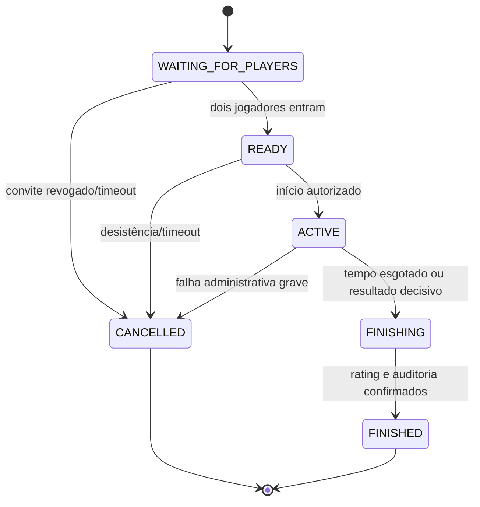

---

# Submissões, Execução e Sandbox

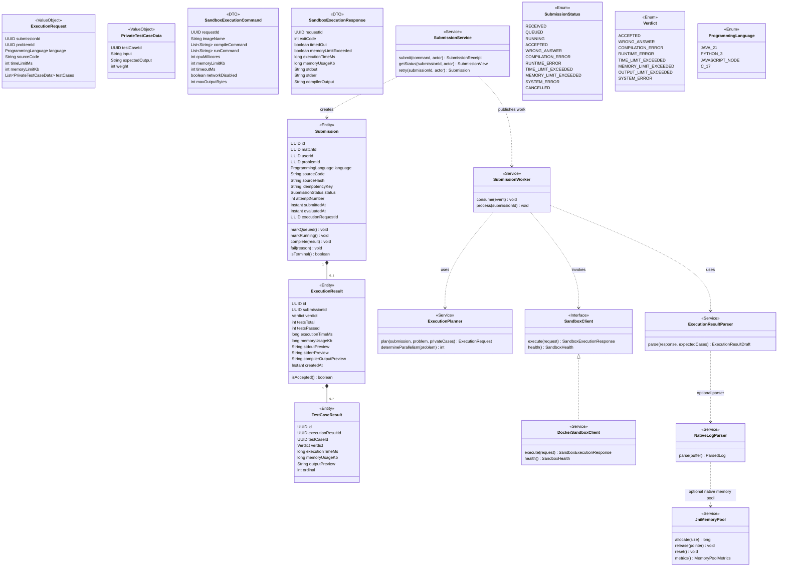

## Máquina de estados de `Submission`

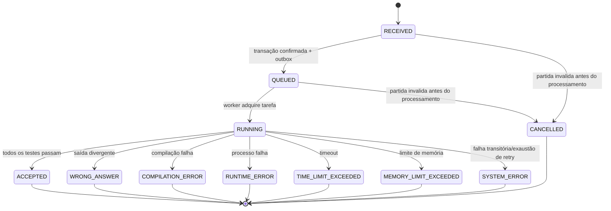

## Regras críticas de execução

- `SubmissionService.submit()` exige JWT válido, regra ABAC de participação na partida, limite de requisições e `Idempotency-Key`.
- A submissão é criada como `RECEIVED/QUEUED` junto de um `OutboxEvent` na mesma transação; a API retorna `202 Accepted`.
- `SubmissionWorker` usa ack manual da mensagem, lock de processamento e estado terminal imutável para tolerar redelivery.
- O sandbox é a única camada que pode compilar/executar código do usuário; ele não recebe credenciais do banco, broker ou serviços externos.
- `NativeLogParser` e `JniMemoryPool` são opcionais no MVP e devem possuir benchmark reproduzível que justifique seu uso.

---

# Rating, Ranking e Estatísticas

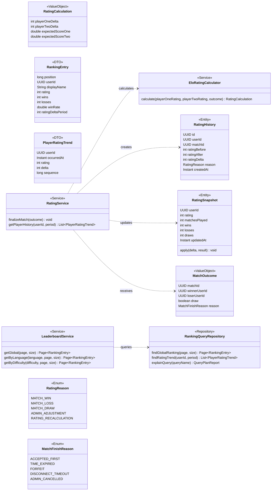

## Regras transacionais do rating

1. `RatingService.finalizeMatch()` bloqueia de forma consistente a partida e os dois snapshots de rating (ordem determinística por `userId`).
2. O serviço valida que a partida ainda não foi finalizada e que as duas pessoas possuem resultado válido.
3. O cálculo Elo/Glicko gera deltas para ambos os participantes.
4. Em uma única transação, atualiza `Match`, `MatchPlayer`, `RatingSnapshot`, duas linhas de `RatingHistory`, `AuditLog` e `OutboxEvent`.
5. Uma falha em qualquer etapa causa `ROLLBACK`; nenhum jogador pode ter o rating alterado isoladamente.

---

# IA, Embeddings e Similaridade

```mermaid
classDiagram
    direction TB

    class Embedding {
        <<Entity>>
        UUID id
        EmbeddableEntityType entityType
        UUID entityId
        String modelName
        String modelVersion
        float[] vector
        String contentHash
        EmbeddingStatus status
        Instant generatedAt
        boolean isCurrentFor(contentHash) boolean
    }

    class Recommendation {
        <<Entity>>
        UUID id
        UUID userId
        UUID problemId
        RecommendationType type
        double score
        String explanationJson
        Instant generatedAt
        Instant expiresAt
        boolean dismissed
    }

    class SimilarityAlert {
        <<Entity>>
        UUID id
        UUID sourceSubmissionId
        UUID comparedSubmissionId
        double lexicalScore
        double embeddingScore
        double combinedScore
        SimilarityAlertStatus status
        UUID reviewedBy
        Instant reviewedAt
        Instant createdAt
        review(decision, reviewerId) void
    }

    class UserLearningProfile {
        <<Entity>>
        UUID userId
        String strengthsJson
        String weaknessesJson
        Instant updatedAt
    }

    class EmbeddingRequest {
        <<Event>>
        UUID eventId
        EmbeddableEntityType entityType
        UUID entityId
        String contentHash
        Instant occurredAt
    }

    class MatchFinishedEvent {
        <<Event>>
        UUID eventId
        UUID matchId
        UUID problemId
        List~UUID~ participantIds
        Instant occurredAt
    }

    class EmbeddingProvider {
        <<Interface>>
        generate(text) float[]
        modelInfo() EmbeddingModelInfo
    }

    class VectorSearchRepository {
        <<Repository>>
        upsert(embedding) void
        findSimilarProblems(vector, filters, limit) List~SimilarProblem~
        findSimilarSubmissions(vector, filters, limit) List~SimilarSubmission~
    }

    class EmbeddingWorker {
        <<Service>>
        consume(request) void
        generateAndStore(entityType, entityId) void
    }

    class RecommendationService {
        <<Service>>
        generateForUser(userId) List~Recommendation~
        recommendSimilarProblems(userId, problemId) List~Recommendation~
    }

    class SimilarityDetectionService {
        <<Service>>
        analyzeSubmission(submissionId) List~SimilarityAlert~
        combineScores(lexical, semantic) double
    }

    class EmbeddableEntityType {
        <<Enum>>
        PROBLEM
        SUBMISSION
        USER_LEARNING_PROFILE
    }

    class EmbeddingStatus {
        <<Enum>>
        PENDING
        READY
        FAILED
        STALE
    }

    class RecommendationType {
        <<Enum>>
        SIMILAR_TO_FAILED
        NEXT_DIFFICULTY
        WEAK_SKILL_REINFORCEMENT
        PERSONALIZED_CHALLENGE
    }

    class SimilarityAlertStatus {
        <<Enum>>
        OPEN
        CONFIRMED
        DISMISSED
        NEEDS_REVIEW
    }

    EmbeddingWorker ..> EmbeddingProvider : requests vector
    EmbeddingWorker ..> VectorSearchRepository : stores
    RecommendationService ..> VectorSearchRepository : searches
    RecommendationService ..> UserLearningProfile : uses
    SimilarityDetectionService ..> VectorSearchRepository : searches
    SimilarityDetectionService ..> SimilarityAlert : creates
    Embedding "1" --> "0..*" Recommendation : supports
```

## Estratégia de recomendação híbrida

- **Conteúdo**: a descrição, tags e solução conceitual de `Problem` geram embedding; a busca vetorial encontra desafios semanticamente próximos.
- **Comportamento**: `UserLearningProfile` consolida acertos, erros, tempo e tags associadas às submissões do usuário.
- **Combinação**: o `RecommendationService` pondera similaridade vetorial, dificuldade, tags deficitárias, histórico recente e diversidade de sugestões.
- **Assíncrono**: embeddings e alertas são derivados por workers; indisponibilidade dessa camada não impede login, partida, submissão ou atualização de rating.

---

# Auditoria, Outbox e Notificações

```mermaid
classDiagram
    direction LR

    class AuditLog {
        <<Entity>>
        long id
        UUID actorUserId
        String action
        String resourceType
        UUID resourceId
        String correlationId
        String requestId
        String ipAddressHash
        String userAgentHash
        String beforeDataJson
        String afterDataJson
        Instant occurredAt
    }

    class SecurityEvent {
        <<Entity>>
        UUID id
        UUID userId
        SecurityEventType type
        String ipAddressHash
        String detailsJson
        SecuritySeverity severity
        Instant occurredAt
    }

    class OutboxEvent {
        <<Entity>>
        UUID id
        String aggregateType
        UUID aggregateId
        String eventType
        String payloadJson
        Instant occurredAt
        Instant publishedAt
        int publicationAttempts
        OutboxStatus status
        markPublished(now) void
        markFailed() void
    }

    class Notification {
        <<Entity>>
        UUID id
        UUID userId
        NotificationType type
        String title
        String body
        String metadataJson
        NotificationStatus status
        Instant createdAt
        Instant readAt
        markRead() void
    }

    class AuditService {
        <<Service>>
        record(command) AuditLog
        search(filter, requester) Page~AuditLog~
    }

    class OutboxPublisher {
        <<Service>>
        publishPending() int
        publish(event) void
    }

    class NotificationService {
        <<Service>>
        create(userId, type, payload) Notification
        markRead(notificationId, userId) void
    }

    class RealTimeNotificationPublisher {
        <<Service>>
        publish(notification) void
        publishMatchEvent(event) void
    }

    class SecurityEventType {
        <<Enum>>
        LOGIN_SUCCEEDED
        LOGIN_FAILED
        TOKEN_REFRESHED
        TOKEN_REVOKED
        ACCESS_DENIED
        RATE_LIMITED
        SUSPICIOUS_SUBMISSION
        WEBHOOK_SIGNATURE_FAILED
    }

    class SecuritySeverity {
        <<Enum>>
        INFO
        WARNING
        HIGH
        CRITICAL
    }

    class NotificationType {
        <<Enum>>
        MATCH_INVITATION
        MATCH_STARTED
        SUBMISSION_EVALUATED
        MATCH_FINISHED
        MODERATION_ACTION
        RECOMMENDATION_READY
    }

    class NotificationStatus {
        <<Enum>>
        UNREAD
        READ
        ARCHIVED
    }

    class OutboxStatus {
        <<Enum>>
        PENDING
        PUBLISHED
        FAILED
    }

    AuditService ..> AuditLog : writes/reads
    OutboxPublisher ..> OutboxEvent : publishes
    NotificationService ..> Notification : manages
    RealTimeNotificationPublisher ..> Notification : delivers
```

## Regras de auditoria

- Alterações administrativas, autenticação, criação/encerramento de partidas, submissões e alterações de rating produzem `AuditLog` e/ou `SecurityEvent`.
- `AuditLog.beforeDataJson` e `afterDataJson` devem aplicar mascaramento de campos sensíveis; senha, refresh token, segredo e código privado de test case nunca entram no log.
- `OutboxEvent` é persistido na mesma transação da alteração de negócio e publicado de modo assíncrono, com tentativas, backoff e fila de falhas quando necessário.

---

# API REST: Controllers, DTOs e Serviços

```mermaid
classDiagram
    direction TB

    class AuthController {
        <<Controller>>
        register(RegisterRequest) ResponseEntity
        login(LoginRequest) ResponseEntity
        refresh(RefreshTokenRequest) ResponseEntity
        logout() ResponseEntity
        oauthCallback(provider) ResponseEntity
    }

    class ProblemController {
        <<Controller>>
        list(ProblemFilter) Page~ProblemSummaryResponse~
        getBySlug(slug) ProblemDetailResponse
        create(CreateProblemRequest) ProblemDetailResponse
        publish(problemId) ResponseEntity
        update(problemId, UpdateProblemRequest) ProblemDetailResponse
    }

    class MatchController {
        <<Controller>>
        create(CreateMatchRequest) MatchResponse
        join(matchId, JoinMatchRequest) MatchResponse
        invite(matchId, CreateInvitationRequest) InvitationResponse
        get(matchId) MatchResponse
        getReplay(matchId) MatchReplayResponse
    }

    class MatchmakingController {
        <<Controller>>
        enqueue(MatchmakingRequest) TicketResponse
        cancel(ticketId) ResponseEntity
        getStatus(ticketId) TicketResponse
    }

    class SubmissionController {
        <<Controller>>
        submit(matchId, SubmitCodeRequest, idempotencyKey) SubmissionReceiptResponse
        get(submissionId) SubmissionResponse
    }

    class LeaderboardController {
        <<Controller>>
        global(page, size) Page~RankingEntryResponse~
        byLanguage(language, page, size) Page~RankingEntryResponse~
        ratingTrend(userId, period) List~RatingTrendResponse~
    }

    class RecommendationController {
        <<Controller>>
        mine() List~RecommendationResponse~
        similar(problemId) List~RecommendationResponse~
        dismiss(recommendationId) ResponseEntity
    }

    class AdminController {
        <<Controller>>
        changeUserStatus(userId, request) UserResponse
        reviewSimilarity(alertId, request) SimilarityAlertResponse
        auditLog(filter) Page~AuditLogResponse~
    }

    class AuthService {
        <<Service>>
        register(request) AuthSession
        login(request) AuthSession
        refresh(token) AuthSession
        logout(userId, token) void
    }

    class ProblemService {
        <<Service>>
        create(request, actor) Problem
        publish(problemId, actor) Problem
        findPublished(filter) Page~Problem~
    }

    class MatchService {
        <<Service>>
        create(request, actor) Match
        join(matchId, actor) Match
        createInvitation(matchId, request, actor) MatchInvitation
    }

    class RegisterRequest {
        <<DTO>>
        String email
        String password
        String displayName
    }

    class LoginRequest {
        <<DTO>>
        String email
        String password
    }

    class CreateProblemRequest {
        <<DTO>>
        String title
        String statement
        Difficulty difficulty
        int timeLimitMs
        int memoryLimitKb
        List~TestCaseRequest~ testCases
        Set~String~ tags
    }

    class CreateMatchRequest {
        <<DTO>>
        UUID problemId
        MatchVisibility visibility
        int durationSeconds
    }

    class SubmitCodeRequest {
        <<DTO>>
        ProgrammingLanguage language
        String sourceCode
    }

    class ApiErrorResponse {
        <<DTO>>
        String type
        String title
        int status
        String detail
        String instance
        String traceId
        List~FieldViolationResponse~ violations
    }

    AuthController ..> AuthService
    ProblemController ..> ProblemService
    MatchController ..> MatchService
    MatchmakingController ..> MatchmakingService
    SubmissionController ..> SubmissionService
    LeaderboardController ..> LeaderboardService
    RecommendationController ..> RecommendationService
    AdminController ..> AuditService
```

## Convenções da API

- Prefixo: `/api/v1`.
- Erros seguem RFC 9457 (`application/problem+json`) por meio de `ApiErrorResponse`.
- Criação assíncrona de submissão retorna `202 Accepted`, cabeçalho `Location` e identificador de submissão.
- Operações com efeito colateral crítico aceitam `Idempotency-Key`; o mesmo usuário e chave devem retornar a mesma resposta sem duplicar efeitos.
- DTOs não expõem entidades JPA diretamente e não retornam test cases privados, hashes, tokens, logs internos ou detalhes de infraestrutura.

---

# WebSocket e Eventos em Tempo Real

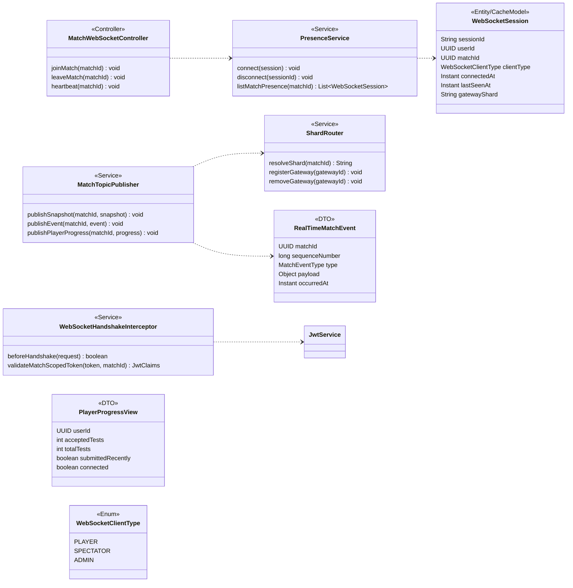

## Regras de tempo real

- O frontend recebe somente eventos necessários à interface: status, timer, conexão, progresso agregado e resultado da submissão.
- Durante uma partida, código-fonte e detalhes de test cases privados não são enviados ao oponente ou espectador.
- Eventos possuem `sequenceNumber`; o cliente usa essa sequência para detectar lacunas e buscar `MatchSnapshot` pela API após reconexão.
- `ShardRouter` aplica consistent hashing em `matchId`; a camada de presença fica no Redis com TTL para não depender de memória local de um único pod.

---

# Persistência: Repositórios e Specifications

```mermaid
classDiagram
    direction TB

    class UserRepository {
        <<Repository>>
        save(user) User
        findById(id) Optional~User~
        findByEmail(email) Optional~User~
        existsByEmail(email) boolean
    }

    class ProblemRepository {
        <<Repository>>
        save(problem) Problem
        findById(id) Optional~Problem~
        findPublished(filter, pageable) Page~Problem~
        findEligibleForMatch(criteria) List~Problem~
    }

    class MatchRepository {
        <<Repository>>
        save(match) Match
        findByIdForUpdate(id) Optional~Match~
        findActiveByUserForUpdate(userId) Optional~Match~
        findPublicLive(pageable) Page~Match~
    }

    class SubmissionRepository {
        <<Repository>>
        save(submission) Submission
        findById(id) Optional~Submission~
        findByUserAndIdempotencyKey(userId, key) Optional~Submission~
        lockPendingForProcessing(id) Optional~Submission~
    }

    class RatingRepository {
        <<Repository>>
        findSnapshotForUpdate(userId) Optional~RatingSnapshot~
        saveHistory(history) RatingHistory
    }

    class AuditLogRepository {
        <<Repository>>
        save(log) AuditLog
        search(filter, pageable) Page~AuditLog~
    }

    class OutboxEventRepository {
        <<Repository>>
        save(event) OutboxEvent
        lockPendingBatch(limit) List~OutboxEvent~
    }

    class EmbeddingRepository {
        <<Repository>>
        findCurrent(entityType, entityId) Optional~Embedding~
        save(embedding) Embedding
    }

    class TransactionManager {
        <<Infrastructure>>
        begin() Transaction
        commit(transaction) void
        rollback(transaction) void
    }

    MatchRepository ..> Match
    SubmissionRepository ..> Submission
    RatingRepository ..> RatingSnapshot
    RatingRepository ..> RatingHistory
    OutboxEventRepository ..> OutboxEvent
```

## Estratégia de transações

- Use `@Transactional` em serviços de aplicação para operações convencionais e `TransactionTemplate` quando o fluxo exigir decisão explícita de `commit`/`rollback` demonstrável.
- Métodos `findByIdForUpdate`, `findActiveByUserForUpdate` e `findSnapshotForUpdate` usam bloqueio pessimista somente em trechos críticos; evite locks longos enquanto aguarda broker, sandbox ou provedor externo.
- Para atualizações comuns de `Match`, o campo `version` habilita locking otimista e retorna conflito (`409 Conflict`) se duas operações alterarem o mesmo estado incompatível.
- Queries de leitura pesada usam `RankingQueryRepository` com JDBC e podem apontar para a réplica, desde que consistência eventual seja aceitável.

---

# Eventos de Domínio e Integração

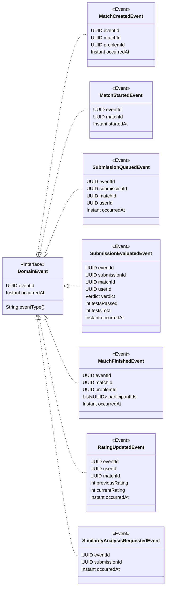

## Tópicos e filas sugeridos

| Evento/fila | Producer | Consumer | Ação |
|---|---|---|---|
| `submission.execute` | Outbox Publisher | Submission Worker | Compilar e avaliar a submissão no sandbox. |
| `submission.evaluated` | Submission Worker | Gateway WebSocket, Match Service, IA | Atualizar progresso, decidir término, gerar análise assíncrona. |
| `match.events` | Match/Rating Service | Gateway WebSocket, Notification Worker | Transmitir início, presença, término e mudanças de estado. |
| `match.finished` | Match Service | Rating Service, IA Worker, Notification Worker | Atualizar rating, gerar recomendações e avisos. |
| `embedding.requested` | Problem/Submission Service | Embedding Worker | Produzir ou atualizar embeddings. |
| `notification.dispatch` | Notification Service | Gateway/E-mail Worker | Entregar notificação em tempo real ou e-mail. |
| `*.dlq` | Broker | Operação/Admin | Isolar mensagens esgotadas para análise e reprocessamento controlado. |

---

# Visão de Pacotes Java

```text
com.andre.arenacode
├── shared
│   ├── domain                 # BaseEntity, DomainEvent, Result, erros de domínio
│   ├── security               # contexto de segurança, JWT, utilitários de hash
│   ├── observability          # traceId, logs estruturados, métricas
│   └── infrastructure         # configurações comuns, exception handler
├── identity
│   ├── domain                 # User, Role, RefreshToken, policies
│   ├── application            # AuthService, OAuthIdentityService
│   ├── adapter.in.web         # AuthController, DTOs
│   └── adapter.out.persistence# repositórios JPA
├── problem
│   ├── domain                 # Problem, TestCase, Tag, pré-requisitos
│   ├── application            # ProblemService
│   ├── adapter.in.web
│   └── adapter.out.persistence
├── match
│   ├── domain                 # Match, MatchPlayer, convite, eventos
│   ├── application            # MatchService, MatchmakingService, ReplayService
│   ├── adapter.in.web         # REST e WebSocket
│   └── adapter.out.persistence
├── submission
│   ├── domain                 # Submission, ExecutionResult, verdicts
│   ├── application            # SubmissionService, ExecutionPlanner
│   ├── adapter.in.messaging   # consumer RabbitMQ
│   ├── adapter.out.sandbox    # DockerSandboxClient
│   └── adapter.out.persistence
├── rating
│   ├── domain                 # RatingSnapshot, EloRatingCalculator
│   ├── application            # RatingService, LeaderboardService
│   └── adapter.out.persistence
├── recommendation
│   ├── domain                 # Embedding, Recommendation, SimilarityAlert
│   ├── application            # RecommendationService, workers
│   └── adapter.out.vector     # pgvector/Qdrant adapter
├── audit
│   ├── domain                 # AuditLog, OutboxEvent, SecurityEvent
│   ├── application            # AuditService, OutboxPublisher
│   └── adapter.out.persistence
└── platform
    ├── config                 # Spring config, AMQP, Redis, OpenAPI
    ├── migration              # Flyway (referência/organização)
    └── deployment             # manifests/Helm fora do jar ou módulo dedicado
```

---

# Ordem de Implementação do Diagrama

## MVP obrigatório

1. `User`, `Role`, `RefreshToken`, `AuthService`, `JwtService` e autenticação básica.
2. `Problem`, `TestCase`, `ProblemService` e catálogo de desafios Java.
3. `Match`, `MatchPlayer`, `MatchService` e uma sala privada por convite.
4. `MatchWebSocketController`, `PresenceService` e atualização de timer/status.
5. `Submission`, `ExecutionResult`, `SubmissionService`, um worker e sandbox Docker para Java.
6. `MatchEvent`, `AuditLog`, `OutboxEvent` e replay básico.

## Fase de robustez

1. `MatchmakingTicket`, `MatchmakingService`, fila automática e locks de concorrência.
2. `RatingSnapshot`, `RatingHistory`, `EloRatingCalculator` e ranking com window functions.
3. Rate limiting Redis, `AuthorizationPolicy` RBAC/ABAC, OAuth2/OIDC e rotação de refresh tokens.
4. RabbitMQ com DLQ, retry e observabilidade de filas.

## Fase avançada

1. `Embedding`, `Recommendation`, `SimilarityAlert`, worker de IA e pgvector.
2. Read replica, cache de ranking, HPA e consistent hashing no gateway WebSocket.
3. `NativeLogParser`/`JniMemoryPool` em C via JNI, apenas após benchmark demonstrar ganho mensurável.

---

# Regras de Modelagem Importantes

- Não trate `MatchPlayer` como simples tabela de junção: ela possui atributos próprios (lado, rating antes/depois, resultado, horários e conexão).
- Não guarde resultado de execução apenas dentro de `Submission`: `ExecutionResult` e `TestCaseResult` tornam o replay, métricas e auditoria extensíveis.
- Não execute lógica de avaliação em controller; controller converte DTO, serviço valida, outbox publica e worker avalia.
- Não deixe RabbitMQ ser a fonte de verdade. PostgreSQL mantém o estado transacional; mensagens propagam trabalho e eventos.
- Não exponha entidades no JSON. Use DTOs de leitura e escrita, aplicando regras de visibilidade a cada endpoint.
- Não use o memory pool C como enfeite: implemente somente em um ponto quente medido e documente benchmark, perfil de alocações, limitações e fallback Java.

---

# Critérios de Aceite do Modelo

- As entidades e relações cobrem cadastro, autorização, problemas, salas, espectadores, submissões, execução, ranking, replay, recomendações e auditoria.
- Uma partida possui exatamente dois `MatchPlayer` com lados distintos, salvo estados de criação/cancelamento controlados.
- Uma submissão possui uma única chave de idempotência por usuário e retorna sempre o mesmo resultado quando repetida.
- A transição para estado terminal de submissão é irreversível e é persistida antes da emissão do evento ao WebSocket.
- O resultado e o rating dos dois jogadores são finalizados em transação atômica.
- Test cases privados não aparecem em DTOs, eventos WebSocket, auditoria nem logs enviados ao cliente.
- Os diagramas Mermaid podem ser renderizados no GitHub, GitLab, VS Code (extensão Mermaid) ou Markdown Preview Mermaid Support.
